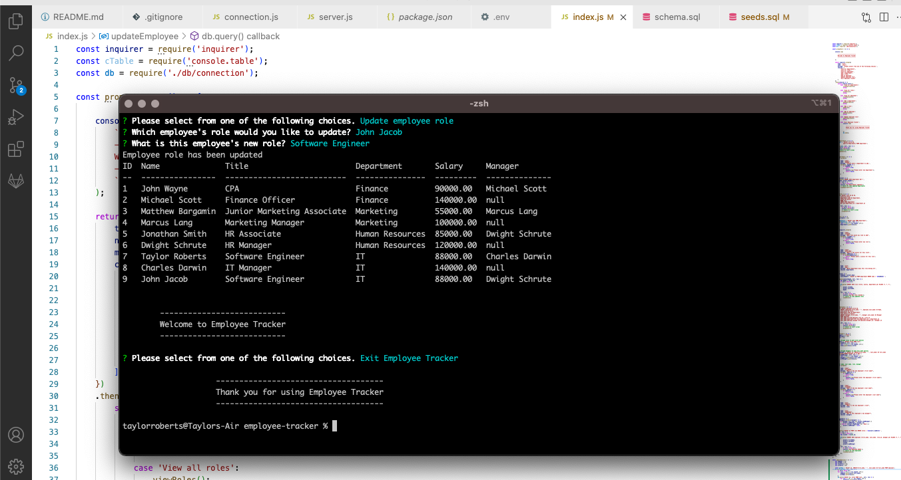

# Employee Tracker

## Description

This application uses inquirer and mysql through the command line to be able to keep track of employees and allows the user to view and add employees, departments  and roles, and update employee roles. This allows for a quick and easy change in the database for the user.

## Installation

In order to use this application the user must first clone the repository. Then the user must install the required dependencies by using running `npm install` in the command line at the root of the project directory. The user will then open mysql with the command `mysql -u root -p` then run `source db/schema.sql` and then `source db/seeds.sql` in order to create the tables and seed them with the data provided in the repository. The user should then `quit` mysql and will be ready to begin using the program.

## Usage

To begin using the application, the user will simply type `npm start` and select choices based on what the user wishes to accomplish.

## Demo

Please click [here](https://drive.google.com/file/d/191JN93udh5Y59CPHnZdmOqIG7x1Nu8rB/view) to watch a demonstration on this command line application.